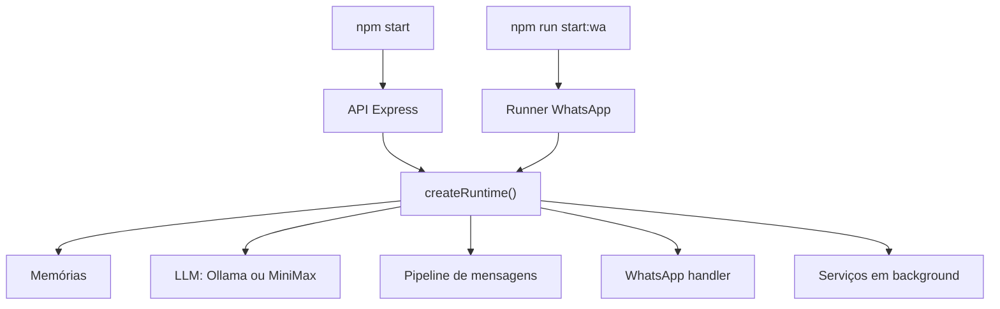
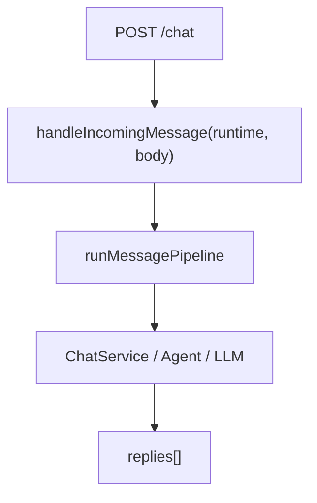
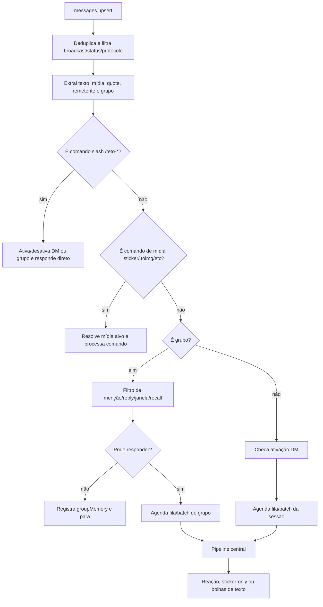
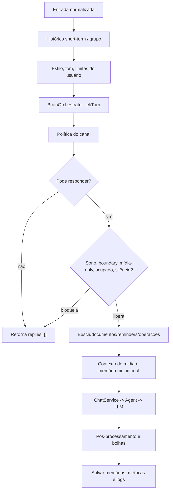

# TetOS - Arquitetura e Fluxos

Este documento mapeia como o programa roda, quais serviços ficam ativos em segundo plano e como ele reage a eventos como mensagens, comandos, mídia, grupos, reminders e chamadas pela API.

## Visão Geral

TetOS tem dois pontos principais de entrada:

- **API HTTP**: `src/infra/api/server.js`, iniciada por `npm start` ou `npm run start:api`.
- **Runner WhatsApp**: `src/integrations/whatsapp/runner.js`, iniciado por `npm run start:wa`.

Ambos criam o mesmo runtime central:

- `src/app/createRuntime.js`

O runtime monta os módulos de memória, LLM, chat, cérebro/vida, canais, documentos, busca, reminders, observabilidade, mídia e WhatsApp.



## Runtime Central

Arquivo: `src/app/createRuntime.js`

O runtime instancia:

- **Memória**: short-term, long-term, seletiva, episódica, grupo e multimodal.
- **LLM principal**: `OllamaClient` ou `MiniMaxClient`, conforme `TETOS_LLM_PROVIDER`.
- **Worker LLM opcional**: usado por vida/narração/resumos quando configurado.
- **ChatService**: chama o agente, pós-processa bolhas, evita eco e repara respostas ruins.
- **BrainOrchestrator**: emoção, vida, sono, timing, confiança, mundo, música, memória e autonomia.
- **ChannelRegistry**: decide se um canal está ativo, passivo, mutado ou bloqueado.
- **TetoActivationStore**: controla `/teto-ativar` e `/teto-grupo-ativar`.
- **SearchModule**: busca web.
- **DocumentModule**: leitura/escrita de documentos locais.
- **OperationRouter**: operações administrativas e confirmações.
- **ReminderStore/Scheduler**: armazenamento e varredura de reminders.
- **Logger/MetricsStore**: logs e métricas persistidas.
- **EventLedger/DailyReportGenerator**: aprendizado e relatórios diários.

## Contratos Arquiteturais

Estes arquivos sao tratados como contrato entre camadas. Ao alterar comportamento de fluxo, atualizar os testes e este documento junto.

| Contrato | Arquivo | Responsabilidade |
| --- | --- | --- |
| Modos de resposta | `src/core/pipeline/responseModes.js` | Nomes canonicos para `full`, `react_only`, `sticker_only`, `learn_only`, bloqueios e saidas (`text`, `reaction`, `sticker`, `silent`, `command`, `ignored`). |
| Identidade WhatsApp | `src/integrations/whatsapp/whatsappIdentityContract.js` | Normaliza `remoteJid`, `userId`, `participantId`, `sessionId`, `channelId` e `channelScope`. |
| Trace de decisao | `src/infra/observability/decisionTrace.js` | Registra a trilha de decisao por evento: entrada, comando, gate de grupo, ativacao, modo do pipeline e saida. |
| Parser de comandos de midia | `src/integrations/whatsapp/mediaCommandParser.js` | Decide se texto com prefixo e comando suportado e normaliza aliases como `.stiker`, `.otimizar`, `.remove-bg`. |
| Servico de comandos de midia | `src/integrations/whatsapp/mediaCommandService.js` | Processa `.sticker`, `.fsticker`, `.csticker`, `.optimize`, `.removebg` e `.toimg` fora do fluxo conversacional. |

Regra pratica: handler de canal coleta contexto e decide gates de entrada; pipeline decide comportamento conversacional; servicos especializados executam comandos diretos sem chamar o LLM.

## Serviços que Rodam por Trás

### Sempre que o runtime sobe

O `BrainOrchestrator` cria um timer próprio quando `TETOS_BRAIN_ENABLED=true`:

- **Background brain tick**
  - Config: `TETOS_BRAIN_BACKGROUND_TICK_MS`.
  - Atualiza mundo, vida, social, música, corpo, saúde, emoção, repetição, confiança e memória.
  - Pode disparar pesquisa musical periódica.
  - Pode disparar evolução/autonomia e pensamentos solo.

### Quando o WhatsApp runner sobe

Arquivo: `src/integrations/whatsapp/runner.js`

O runner agenda loops auxiliares:

| Serviço | Config principal | O que faz |
| --- | --- | --- |
| Life tick | `TETOS_LIFE_TICK_MS` | Atualiza rotina/vida em intervalo maior. |
| Presence/nudges | `PRESENCE_ENABLED`, `PRESENCE_CHECK_MS` | Decide se a Teto deve puxar assunto com usuários conhecidos. |
| Reminder sweep | `TETOS_REMINDER_SWEEP_MS` | Procura reminders vencidos e tenta entregar no WhatsApp. |
| Daily report | `DAILY_REPORT_ENABLED`, `DAILY_REPORT_TIME` | Gera relatório diário quando chega o horário. |
| Media retention | `TETOS_MEDIA_RETENTION_ENABLED`, `TETOS_MEDIA_RETENTION_INTERVAL_MS` | Limpa/arquiva mídia antiga para controlar tamanho de `data/media`. |
| Mind-log retention | `TETOS_MIND_LOG_RETENTION_DAYS` | Remove mind logs antigos. |
| Inbound watchdog | `WHATSAPP_INBOUND_STALE_MS` | Opcional; reconecta se o socket parecer conectado mas não receber mensagens. |
| Reconnect WhatsApp | `WHATSAPP_AUTO_CONNECT` | Tenta reconectar após queda, exceto logout real. |

## Modos do WhatsApp

### Single

Config:

```env
WHATSAPP_MODE=single
```

Um único socket faz tudo:

- lê mensagens
- aprende
- responde
- processa comandos de mídia
- entrega reminders
- envia nudges

### Dual

Config:

```env
WHATSAPP_MODE=dual
WHATSAPP_MAIN_OBSERVE_ONLY=true
```

Dois sockets:

- **main**: número principal, observa chats e aprende.
- **media/bot**: número da Teto, responde chat e processa `.sticker`, `.toimg`, etc.

Se `WHATSAPP_MAIN_OBSERVE_ONLY=false`, o main também pode responder e o media fica mais focado em comandos de mídia.

## Fluxo da API HTTP

Arquivo: `src/infra/api/server.js`

### `POST /chat`



Esse caminho é parecido com uma mensagem normal, mas sem Baileys, sem fila de WhatsApp, sem typing e sem envio real para WhatsApp.

### Endpoints operacionais

- `POST /memory/save`, `POST /memory/delete`, `GET /memory`, `GET/POST /memory/search`.
- `POST /session/clear`.
- `GET /channels`, `GET /channels/:channelId`, `POST /channels/admin`.
- `POST /search`.
- `GET /documents`, `GET /documents/:id`, `POST /documents/:id`.
- `GET /reminders`.
- `GET /memory/multimodal`.
- `POST /operations`.
- `GET /logs`, `GET /metrics`, `GET /runtime/summary`, `GET /status`.

## Fluxo Geral de Mensagem no WhatsApp

Arquivo principal: `src/integrations/whatsapp/messageHandler.js`



## Etapas do Handler de WhatsApp

### 1. Recepção e filtros iniciais

O handler:

- ignora `status@broadcast` e broadcasts.
- ignora mensagens de protocolo sem conteúdo útil.
- deduplica mensagens por ID por alguns minutos.
- trata deleções/revokes para remover snapshots quando possível.
- extrai:
  - `remoteJid`
  - `isGroup`
  - `participantId`
  - `userId`
  - `sessionId`
  - texto
  - mídia
  - quote/reply
  - `pushName`

### 2. Identidade em DM e grupo

Em DM:

- `remoteJid` representa o usuário.
- `userId` costuma ser o telefone extraído.
- `sessionId` é ligado ao DM.

Em grupo:

- `remoteJid` é o ID do grupo.
- `participantId` identifica quem falou.
- `userId` é o participante.
- `sessionId` separa conversas por grupo + participante.
- O canal do grupo também tem memória própria.

O `ChannelRegistry` guarda participantes, JIDs, telefones quando disponíveis e modo do canal.

Contrato atual: a montagem de identidade deve passar por `buildWhatsappIdentitySnapshot()` sempre que uma decisao de fluxo for registrada. Isso evita misturar chat (`remoteJid`), pessoa (`userId`), fila (`sessionId`) e escopo de memoria (`channelScope`).

### 3. Comandos slash de ativação

Arquivo: `src/integrations/whatsapp/tetoSlashCommands.js`

Comandos:

- `/teto-ativar`
- `/teto-desativar`
- `/teto-grupo-ativar`
- `/teto-grupo-desativar`

Fluxo:

1. O handler detecta comando com `/`.
2. `handleTetoSlashCommand()` valida se é DM ou grupo.
3. Atualiza `TetoActivationStore`.
4. Envia uma resposta curta direto pelo socket.
5. Não passa pelo pipeline normal de LLM.

### 4. Comandos de mídia

Prefixo padrão: `COMMAND_PREFIX=.`

Comandos:

- `.sticker`
- `.fsticker`
- `.csticker`
- `.optimize`
- `.removebg`
- `.toimg`
- `.help`

Fluxo:

1. `parseWhatsAppCommand()` em `mediaCommandParser.js` detecta o comando.
2. `.help` responde direto com a lista de comandos.
3. Para comandos de mídia, `MediaCommandService` chama `resolveCommandTarget()` e procura mídia:
   - na própria mensagem
   - no reply
   - no histórico recente do chat
4. `MediaProcessor` processa:
   - imagem/vídeo/GIF para sticker
   - sticker para imagem/GIF/vídeo
   - compressão de sticker
   - remoção de fundo
5. Envia resultado no WhatsApp.
6. Registra evento em `eventLedger`.
7. Não gera resposta conversacional pelo LLM.

Em modo dual, se o comando chega no número errado, o main pode ignorar ou responder o hint configurado por `WHATSAPP_STICKER_COMMANDS_DISABLED_HINT`.

Contrato atual: comandos de midia sao saida `command` no `decisionTrace` e nao entram em `runMessagePipeline()`.

### 5. Repertório de figurinhas

Arquivos:

- `src/integrations/whatsapp/stickerRepertoire.js`
- `src/integrations/whatsapp/stickerRepertoireModeStore.js`
- `data/stickers/catalog.json`

Fluxo:

1. Figurinhas recebidas podem ser salvas em `data/stickers/` com metadados no catálogo.
2. Com `modoRepertorio("on")` ativo para o usuário, figurinhas recebidas entram no repertório automaticamente.
3. Visão pode nomear figurinhas (`visionDescription`, `displayName`) ao salvar.
4. `formatRepertoireForPrompt()` injeta chaves recentes no prompt do agente.
5. O agente envia figurinhas do repertório com `sticker("chave")` na resposta.

Persistência:

- `TETOS_STICKERS_PATH` (padrão `./data/stickers`)
- `TETOS_STICKER_REPERTOIRE_MODE_PATH` (padrão `./data/stickerRepertoireMode.json`)

### 6. Comandos de ação do agente

Arquivos:

- `src/modules/chat/chatService.js` (`parseActionCommands`)
- `src/integrations/whatsapp/agentMediaCommands.js`

Após o LLM responder, `ChatService` extrai comandos embutidos no texto:

- `reagir("❤️")` / `react("👍")` — reação à mensagem
- `sticker("chave")` — envia figurinha do repertório; segundo arg opcional faz quote
- `mensagem("texto")` / `message("texto", "msg_id")` — bolha com quote opcional
- `salvarSticker("message_id")` — salva figurinha no repertório (chave opcional)
- `modoRepertorio("on"|"off")` — liga/desliga auto-save de figurinhas recebidas
- equivalentes de mídia por message id: `toimg("msg_id")`, `removebg("msg_id")`, etc.

Esses comandos são executados pelo orchestrator do WhatsApp após a geração, sem passar pelo parser de comandos com prefixo `.`.

## Decisão: Mensagem é Comando ou Conversa?

Ordem prática:

1. Se começa com `/teto-...`, é comando de ativação.
2. Se começa com `COMMAND_PREFIX` e está na lista de mídia, é comando de mídia.
3. Se é mídia sem texto e sem comando:
   - salva/analisa mídia quando aplicável.
   - normalmente não responde se não for direcionada à Teto.
4. Caso contrário, é conversa e entra no fluxo de grupo/DM + pipeline.

## Fluxo em Grupo

Em grupo, o bot é mais conservador.

### Antes do pipeline

O handler avalia:

- mensagem menciona a Teto?
- é reply para mensagem da Teto?
- chama pelo nome de forma clara?
- existe janela de engajamento ativa?
- há recall/contexto da memória de grupo?
- grupo está ativado quando `TETOS_ACTIVATION_REQUIRED=true`?

Se não houver motivo para responder:

- a mensagem pode ser registrada em `groupMemory`.
- não gera LLM.
- não envia resposta.

### Janela de engajamento

Quando alguém menciona ou responde a Teto no grupo, `GroupEngagementWindow` mantém uma janela curta configurada por:

```env
TETOS_GROUP_ENGAGEMENT_MS=120000
```

Dentro dessa janela, o mesmo contexto pode receber resposta mesmo sem nova menção direta.

### Política de canal

Arquivo: `src/core/channels/channelRegistry.js`

Se o grupo tem muitos participantes, o canal pode entrar em modo `passive`.

No modo `passive`:

- responde se houver menção direta, reply ou janela ativa.
- responde a perguntas diretas em alguns casos.
- pode permitir `react_only` aleatório.
- caso contrário, ignora.

### Fila de grupo

Mensagens de grupo são agrupadas por canal:

- espera `TETOS_GROUP_BATCH_WINDOW_MS`.
- considera se alguém ainda está digitando.
- usa `planGroupTurnSegments()` para dividir turnos quando há múltiplos assuntos/quotes.
- processa em fila por grupo para evitar respostas atropeladas.

## Fluxo em DM

Em DM, o fluxo é mais direto:

1. Checa ativação se `TETOS_ACTIVATION_REQUIRED=true`.
2. Se o usuário for owner, pode autoativar DM.
3. Se não estiver ativo, responde instrução para `/teto-ativar` e para.
4. Se estiver ativo, agenda em fila por sessão.
5. Mensagens próximas podem ser fundidas em uma só entrada.
6. A entrada vai para o pipeline central.

## Fila, Batch e Interrupção

O `createConversationOrchestrator()` organiza envio e geração.

### Por que existe

- Evitar responder a cada bolha pequena imediatamente.
- Juntar mensagens consecutivas do usuário.
- Aguardar se o usuário ainda está digitando.
- Interromper resposta antiga se chegou mensagem nova.
- Evitar várias gerações simultâneas para a mesma sessão/grupo.

### Regras gerais

- DM usa `TETOS_BATCH_WINDOW_MS`.
- Grupo usa `TETOS_GROUP_BATCH_WINDOW_MS`.
- Se a fila cresce demais, mensagens são coalescidas até `TETOS_MAX_QUEUE_COALESCE`.
- Cada sessão tem fila própria.
- Grupo tem fila por canal.
- Antes de enviar bolhas, se chegou nova mensagem, o token de interrupção cancela o envio antigo.

## Pipeline Central de Mensagem

Arquivo: `src/core/pipeline/messagePipeline.js`



### O que o pipeline decide

O pipeline pode retornar sem resposta se:

- política de canal bloqueou.
- Teto está dormindo/indisponível.
- usuário impôs limite forte.
- mídia veio sozinha sem endereçamento.
- Teto está ocupada em foco alto.
- timing calculou silêncio apropriado em grupo.
- `REPLY_ENABLED=false`.
- socket main está em modo observe-only.

Os modos retornados pelo pipeline devem usar `RESPONSE_MODES`. Evitar strings soltas como `"react_only"` ou `"timing_silence"` fora de `responseModes.js`.

### Intenções internas

Antes de chamar o LLM, ele detecta e monta contexto para:

- busca web
- confirmação de operação pendente
- comandos naturais administrativos
- documento local
- reminder
- mídia atual
- memória multimodal recente
- lore musical, como Machine Love

### Reminders no pipeline

O usuário pode pedir para criar/listar/concluir reminders por linguagem natural.

O pipeline:

- detecta intenção com `detectReminderIntent()`.
- cria/lista/conclui no `ReminderStore`.
- passa um `reminderContext` para a resposta.
- o envio futuro do reminder vencido é feito pelo loop do WhatsApp runner.

### Operações administrativas

O pipeline detecta:

- comandos administrativos explícitos
- linguagem natural administrativa
- respostas de confirmação

Dependendo da operação, pode:

- executar direto
- pedir confirmação
- bloquear por falta de permissão
- mutar/bloquear canal sem gerar resposta longa

## BrainOrchestrator no Turno

Arquivo: `src/core/brain/BrainOrchestrator.js`

Em cada mensagem conversacional, `tickTurn()` atualiza:

- sono e disponibilidade
- mundo/contexto
- corpo, saúde e emoção
- vida/rotina
- social
- música
- confiança/intimidade
- memória de recuperação
- mídia atual
- fase da conversa
- plano de timing
- arbitragem de comportamento
- blocos consciente/subconsciente para o prompt

O resultado influencia:

- se responde ou silencia
- delay de leitura/pensamento/digitação
- tom e contexto da resposta
- close decision: responder, reagir, silenciar ou despedida curta

## ChatService e Agent

Arquivo: `src/modules/chat/chatService.js`

O `ChatService`:

- aplica delay de pensamento.
- decide encerramento natural.
- chama `Agent.respond()`.
- divide resposta em bolhas via `ResponseProcessorPool`.
- evita eco do usuário.
- regenera quando detecta resposta cega ao contexto.
- evita drift/meta estranho.
- registra turno na short-term memory.
- retorna `replies[]`.

O envio final das bolhas é feito pelo WhatsApp orchestrator, não pelo `ChatService`.

## Saída: Texto, Reação ou Sticker

Depois do pipeline:

1. Se `replies[]` tem texto, o WhatsApp envia bolhas.
2. Se a decisão é `react` ou modo `react_only`, tenta reagir à mensagem.
3. Se modo passivo escolheu `sticker_only`, tenta enviar sticker local via `resolveStickerAsset("ack")` (fallback: `ok`, `thumbs_up`, `heart`).
4. Se o agente emitiu `sticker("chave")`, envia figurinha do repertório em `data/stickers/`.
5. Se não há texto nem ação passiva nem sticker do agente, fica em silêncio.

**Dois fluxos de figurinha:**

| Fluxo | Gatilho | Resolução de asset |
| --- | --- | --- |
| Passivo | `react_only` + chance configurada | `ack.webp` → `ok.webp` → `thumbs_up.webp` → `heart.webp` |
| Agente | `sticker("chave")` na resposta do LLM | `data/stickers/{chave}.webp` ou entrada em `catalog.json` |

Cada evento WhatsApp deve finalizar um `decisionTrace` com uma destas saidas:

- `text`: houve envio de bolha textual.
- `reaction`: houve reacao.
- `sticker`: houve sticker passivo.
- `silent`: o evento foi processado sem resposta.
- `command`: um comando direto foi executado.
- `ignored`: o evento foi descartado por filtro, gate ou duplicidade.

### Digitação e delays

No DM:

- simula `composing`.
- espera delay calculado pelo timing.
- pausa antes de enviar.
- divide múltiplas bolhas com intervalo.

No grupo:

- evita typing longo.
- usa delay menor/mais discreto.
- pode responder com quote.

## Mídia e Aprendizado Multimodal

Quando chega mídia:

- `mediaStore` persiste arquivo em `data/media`.
- áudio pode ser transcrito.
- imagem/vídeo/GIF pode receber análise visual.
- sticker entra como tipo de mídia.
- `MediaLearningHub` aprende afinidades.
- `multimodalMemory` salva mídia + mensagem.
- contexto recente pode entrar no prompt como `[RECENT MULTIMODAL MEMORY]`.

Se a mídia vier sem texto e sem endereçar a Teto, o sistema tende a aprender/guardar sem responder.

## Eventos de Grupo do WhatsApp

O runner também escuta:

- `chats.update`
- `groups.update`
- `group-participants.update`

Esses eventos:

- alimentam `eventLedger`.
- atualizam participantes no `ChannelRegistry`.
- ajudam o sistema a saber tamanho/modo do grupo.

## Reconnect, Lock e Estabilidade

O runner:

- cria `.wa-runner.lock` para evitar dois runners simultâneos.
- tenta reconectar em quedas quando `WHATSAPP_AUTO_CONNECT=true`.
- não reconecta automaticamente se o WhatsApp fez logout real.
- pode detectar conflito quando outro processo/sessão substituiu a conexão.
- suprime logs muito ruidosos do Baileys.

## Estados Persistidos Importantes

| Arquivo/pasta | Uso |
| --- | --- |
| `data/session` | Sessão Baileys principal. |
| `data/session-media` | Sessão Baileys secundária em modo dual. |
| `data/memory.json` | Long-term memory e perfis. |
| `data/short-term` | Histórico recente por sessão. |
| `data/selectiveMemory.json` | Memória seletiva antes de promoção. |
| `data/groupMemory.ndjson` | Memória de grupos. |
| `data/episodicMemory.ndjson` | Episódios conversacionais. |
| `data/multimodalMemory.json` | Memória multimodal. |
| `data/media` | Arquivos recebidos e derivados. |
| `data/reminders.json` | Reminders. |
| `data/channels.json` | Estado de canais/grupos. |
| `data/tetoActivations.json` | Ativações DM/grupo. |
| `data/stickers/catalog.json` | Catálogo do repertório de figurinhas. |
| `data/stickerRepertoireMode.json` | Modo repertório por usuário. |
| `data/logs/tetos.log` | Logs estruturados. |
| `data/metrics.json` | Métricas. |
| `data/mind-log` | Logs de mente/turnos. |
| `data/reports/daily` | Relatórios diários. |

## Resumo das Decisões Mais Importantes

| Pergunta | Quem decide | Resultado |
| --- | --- | --- |
| É comando `/teto-*`? | `parseTetoSlashCommand()` | Executa ativação e para. |
| É comando `.sticker` etc.? | `parseWhatsAppCommand()` | Processa mídia e para. |
| Pode responder em grupo? | Handler + `ChannelRegistry` + `GroupEngagementWindow` | Responde, registra sem responder ou ignora. |
| DM está ativo? | `TetoActivationStore` | Libera ou bloqueia. |
| Deve responder ou silenciar? | `ChannelRegistry`, `BrainOrchestrator`, `ChatService` | Texto, reação, sticker ou silêncio. |
| Deve criar reminder? | `detectReminderIntent()` | Salva em `ReminderStore`. |
| Reminder vencido deve ser enviado? | `ReminderScheduler` + loop do runner | Envia WhatsApp ou registra falha. |
| Deve puxar assunto sozinho? | `InitiationEngine` + `BasicLoop` + presence loop | Envia iniciativa no DM. |
| Deve guardar memória? | Pipeline + MemoryOrchestrator | Atualiza long-term, medium-term, seletiva, episódica, grupo e multimodal. |

## Caminho Mental Para Debug

Quando algo não responde, verificar nesta ordem:

1. `WHATSAPP_ENABLED`, `REPLY_ENABLED` e conexão do runner.
2. Se `TETOS_ACTIVATION_REQUIRED=true`, conferir `/teto-ativar` ou `/teto-grupo-ativar`.
3. Em grupo, confirmar menção/reply/janela de engajamento.
4. Conferir `data/channels.json` para modo `blocked`, `muted` ou `passive`.
5. Ver `data/logs/tetos.log` por `pipeline.policy`, `pipeline.sleep_hold`, `pipeline.timing_silence`, `pipeline.observe_only`.
6. Conferir `/status` e `/runtime/summary`.
7. Se for comando de mídia, confirmar se havia mídia alvo e olhar eventos `command.media`.
8. Se for LLM, checar modelo, chave, timeout e logs de `whatsapp.model_timeout`.
9. Se figurinha do agente não saiu, conferir `data/stickers/catalog.json` e se o LLM emitiu `sticker("chave")`.

## Testes de Contrato

Os testes arquiteturais ficam em `tests/architecture` e rodam com:

```bash
npm run test:architecture
```

Eles cobrem:

- parser e aliases de comandos de midia (`mediaCommandParser.test.js`).
- constantes de modos/saidas e decisao passiva de canal (`responseModes.test.js`).
- criacao e finalizacao de `decisionTrace` (`decisionTrace.test.js`).
- protocolo de comandos de acao do agente (`actionCommands.test.js`).

`npm run test:all` tambem chama estes testes, mas depende da API local e do provedor LLM configurado para os testes de chat.
