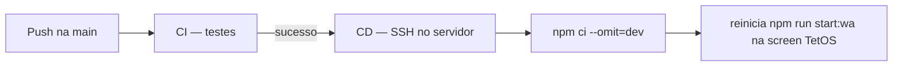

# Deploy do WhatsApp Runner (`npm run start:wa`)

Este guia descreve como configurar **CI** (testes automáticos) e **CD** (deploy automático do runner WhatsApp) com GitHub Actions.

Em produção, o projeto roda dentro de uma **GNU screen** chamada **`TetOS`** — não via PM2.

## Visão geral

| Etapa | Workflow | Quando roda | O que faz |
|-------|----------|-------------|-----------|
| **CI** | `.github/workflows/cicd.yml` (job `test`) | Push e PR na `main` | `npm ci` + `npm run test:ci` |
| **CD** | `.github/workflows/cicd.yml` (job `deploy`) | Push na `main` (após testes) ou manual | SSH no servidor → `git pull` → `scripts/deploy-wa.sh` → reinicia na screen `TetOS` |

Fluxo após merge na `main`:



O runner em produção equivale a:

```bash
screen -r TetOS
# dentro da screen:
npm run start:wa
# node src/integrations/whatsapp/runner.js
```

---

## 1. Preparar o servidor (VPS)

Requisitos:

- **Ubuntu/Debian** (ou Linux compatível)
- **Node.js 20+** (mesma versão do `.nvmrc`)
- **GNU screen**
- **Git** com acesso ao repositório
- Porta SSH aberta para o GitHub Actions

### 1.1 Instalar Node.js 20

```bash
curl -fsSL https://deb.nodesource.com/setup_20.x | sudo -E bash -
sudo apt-get install -y nodejs
node -v   # deve ser v20.x
```

### 1.2 Instalar GNU screen

```bash
sudo apt-get install -y screen
screen -v
```

### 1.3 Clonar o repositório

```bash
sudo mkdir -p /opt/tetos
sudo chown "$USER":"$USER" /opt/tetos
git clone https://github.com/SEU_USUARIO/SEU_REPO.git /opt/tetos
cd /opt/tetos
```

### 1.4 Configurar ambiente

```bash
cp .env.example .env
nano .env
```

Variáveis mínimas para o WhatsApp:

```env
WHATSAPP_ENABLED=true
WHATSAPP_MODE=single
WHATSAPP_SESSION_PATH=./data/session
WHATSAPP_AUTO_CONNECT=true
REPLY_ENABLED=true
```

Configure também o LLM (`TETOS_LLM_PROVIDER`, chaves de API, etc.) conforme o [RUNBOOK](./RUNBOOK.md).

> **Sessão WhatsApp:** `data/session/` não vai para o Git. No primeiro start, escaneie o QR Code dentro da screen (`screen -r TetOS`).

### 1.5 Primeiro start manual (screen TetOS)

```bash
cd /opt/tetos
npm ci
screen -S TetOS
npm run start:wa
```

Escaneie o QR Code se necessário. Para sair **sem parar** o processo:

```
Ctrl+A, depois D
```

Confirme que o bot conectou antes de ativar o CD automático:

```bash
screen -ls    # deve listar algo como 12345.TetOS (Detached)
```

---

## 2. Configurar GitHub Secrets

No repositório: **Settings → Secrets and variables → Actions → New repository secret**

| Secret | Obrigatório | Exemplo | Descrição |
|--------|-------------|---------|-----------|
| `SSH_HOST` | Sim | `203.0.113.10` | IP ou hostname da VPS |
| `SSH_USER` | Sim | `deploy` | Usuário SSH |
| `SSH_PRIVATE_KEY` | Sim | conteúdo da chave privada | Chave **sem senha** para o Actions |
| `DEPLOY_PATH` | Sim | `/opt/tetos` | Caminho do clone no servidor |

### 2.1 Gerar chave SSH para deploy

No seu computador Linux:

```bash
ssh-keygen -t ed25519 -C "github-actions-tetos-wa" -f ~/.ssh/tetos_wa_deploy -N ""
```

- **Chave pública** → adicione em `~/.ssh/authorized_keys` do usuário de deploy no servidor.
- **Chave privada** (`tetos_wa_deploy`) → cole inteira no secret `SSH_PRIVATE_KEY`.

Teste antes de configurar o Actions:

```bash
ssh -i ~/.ssh/tetos_wa_deploy deploy@SEU_SERVIDOR "cd /opt/tetos && git status"
```

### 2.2 Permissões do usuário de deploy

O usuário SSH precisa de:

- Leitura/escrita em `DEPLOY_PATH`
- Executar `git`, `npm`, `screen`
- Ler o `.env` (não versionado)
- Acessar a screen `TetOS` (mesmo usuário que criou a sessão)

---

## 3. Workflow unificado

Arquivo: `.github/workflows/cicd.yml` (nome **CI/CD** no GitHub Actions).

### Job `test` — CI

Roda em todo **push** e **pull request** na branch `main`:

1. Checkout do código
2. Node.js 20 (`.nvmrc`)
3. `npm ci`
4. `npm run test:ci`

Para validar localmente antes de abrir PR:

```bash
npm ci
CI=true npm run test:ci
```

### Job `deploy` — CD

Roda automaticamente após o job `test` passar, somente em:

- **Push na `main`**
- **Execução manual** em **Actions → CI/CD → Run workflow**

Em **pull requests**, só o job `test` roda (sem deploy).

Passos no servidor:

1. `git fetch` + `git reset --hard` no commit do push
2. `bash scripts/deploy-wa.sh`

O script `scripts/deploy-wa.sh`:

- Verifica se `.env` existe
- Roda `npm ci --omit=dev`
- Se a screen **`TetOS`** já existe: envia `Ctrl+C` e relança `npm run start:wa`
- Se não existe: cria `screen -dmS TetOS` com o comando de start

Variáveis opcionais no servidor:

```bash
export TETOS_SCREEN_NAME=TetOS      # padrão
export TETOS_START_CMD="npm run start:wa"  # padrão
```

---

## 4. Deploy manual

### Pelo GitHub Actions

1. Vá em **Actions**
2. Selecione **CI/CD**
3. **Run workflow** → escolha branch/ref (padrão: `main`)

### Direto no servidor

```bash
cd /opt/tetos
git pull origin main
bash scripts/deploy-wa.sh
```

---

## 5. Operação e monitoramento (screen)

```bash
# Listar screens
screen -ls

# Entrar na screen e ver logs ao vivo
screen -r TetOS

# Sair sem parar o processo
# Ctrl+A, depois D

# Reinício manual dentro da screen
screen -r TetOS
# Ctrl+C para parar
npm run start:wa
# Ctrl+A, D para detach

# Ou use o script de deploy
bash scripts/deploy-wa.sh
```

Após deploy, valide:

- `screen -ls` mostra `TetOS` como `(Detached)`
- Logs sem erros de conexão WhatsApp (`screen -r TetOS`)
- Bot responde a uma mensagem de teste

---

## 6. Troubleshooting

| Problema | Causa provável | Solução |
|----------|----------------|---------|
| CD não dispara | CI falhou ou push não foi na `main` | Corrija o CI; confira branch |
| `Permission denied (publickey)` | Chave SSH incorreta | Revise `SSH_PRIVATE_KEY` e `authorized_keys` |
| `DEPLOY_PATH: No such file` | Caminho errado no secret | Ajuste `DEPLOY_PATH` |
| `.env ausente` | Primeiro deploy sem config | Crie `.env` no servidor |
| Bot pede QR de novo | Sessão apagada ou `data/session` limpo | `screen -r TetOS`, escaneie QR; não apague `data/session` |
| `npm ci` falha | Node desatualizado no servidor | Instale Node 20+ |
| `screen: command not found` | GNU screen não instalado | `sudo apt install screen` |
| `Cannot open your terminal` | Deploy SSH sem TTY | Normal no Actions; o script usa `screen -X` (não precisa de TTY) |
| Screen existe mas processo não sobe | Node/npm fora do PATH no deploy | Use `bash -lc` ou ajuste `TETOS_START_CMD` com caminho completo do node |

---

## 7. Segurança

- **Nunca** commite `.env` ou `data/session/`.
- Use um usuário Linux dedicado ao deploy (não `root`).
- Restrinja a chave SSH só ao host e comandos necessários.
- Rotacione chaves periodicamente.
- O CD só roda após CI verde na `main`.

---

## 8. Expandir no futuro

Esta base pode evoluir para:

- Deploy da API (`start:api`) na mesma screen ou em outra
- Ambientes `staging` / `production` com secrets por environment
- Notificação no Discord/Telegram após deploy
- Health check HTTP pós-deploy (`GET /status` se a API estiver na mesma VPS)

Arquivos relacionados:

- `scripts/deploy-wa.sh` — script de deploy no servidor (screen `TetOS`)
- `.github/workflows/cicd.yml` — pipeline CI/CD (testes + deploy)
