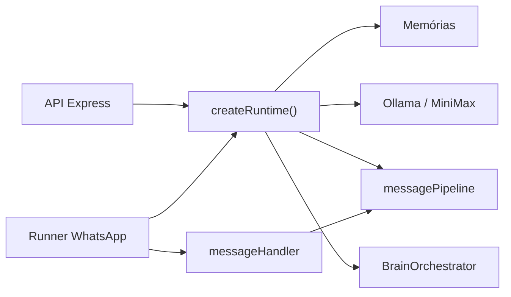

# Mapeamento de funcionalidades — TetOS (Teto)

Documento de referência para **o que a Teto já faz**, **como executa** e **em quais condições**. Serve para inventário de produto, onboarding e debug.

**Documentos complementares (mais técnicos):**

| Documento | Foco |
| --- | --- |
| [CAPACIDADES_TETO.md](./CAPACIDADES_TETO.md) | Lista prática resumida |
| [ARQUITETURA_E_FLUXOS.md](./ARQUITETURA_E_FLUXOS.md) | Fluxos, serviços em background, contratos de código |
| [RUNBOOK.md](./RUNBOOK.md) | Instalação e operação |
| [MANUAL_TEST_WA.md](./MANUAL_TEST_WA.md) | Testes manuais no WhatsApp |

---

## Visão em uma frase

TetOS é um **runtime local** (Node.js) que une **API HTTP**, **WhatsApp (Baileys)**, **LLM** (Ollama ou MiniMax), **memória em camadas**, **processamento de mídia**, **estado de “vida”** (sono, emoção, timing) e **aprendizado/observabilidade** — tudo montado em `createRuntime()`.

---

## Como o programa roda

| Processo | Comando | Arquivo principal |
| --- | --- | --- |
| API HTTP | `npm start` / `npm run start:api` | `src/infra/api/server.js` |
| WhatsApp | `npm run start:wa` | `src/integrations/whatsapp/runner.js` |
| Ambos (PM2) | `npm run pm2:start` | `scripts/pm2.config.cjs` |

Os dois processos compartilham o mesmo **runtime** (`src/app/createRuntime.js`): memórias, LLM, pipeline, cérebro, canais, documentos, busca, reminders, métricas.

---

## Ordem de decisão (WhatsApp)

Quando chega uma mensagem, o handler aplica **esta ordem** (o que casa primeiro “ganha” e em geral **não** chama o LLM):

| # | Tipo | Quem decide | Efeito |
| --- | --- | --- | --- |
| 1 | Filtros | `messageHandler` | Ignora broadcast/status/protocolo; deduplica por ID |
| 2 | Slash `/teto-*` ou `.teto-ativar` etc. | `tetoSlashCommands.js` | Ativa/desativa DM ou grupo; resposta curta direta |
| 3 | Comando com prefixo (padrão `.`) | `mediaCommandParser.js` → `mediaCommandService.js` | Mídia, download, gerar imagem, help — **sem conversa** |
| 4 | `.tetos` / `/tetos` | `tetosCommand.js` | Uma pergunta pontual à IA (**one-shot**); reply na resposta não abre conversa |
| 5 | Grupo sem endereçamento | Handler + `ChannelRegistry` + `GroupEngagementWindow` | Aprende/registra em `groupMemory`; **sem resposta** |
| 6 | DM sem ativação | `TetoActivationStore` | Instrução para ativar (se `TETOS_ACTIVATION_REQUIRED=true`) |
| 7 | Conversa normal | Fila/batch → `runMessagePipeline()` | LLM + pós-processamento + envio |

**Regra de ouro:** comandos de mídia e ativação são saída `command` no `decisionTrace`; conversa passa pelo pipeline.

---

## 1. Conversação e resposta

### O que faz

- Responde via `POST /chat` (sem WhatsApp) ou no WhatsApp após o pipeline.
- Mantém histórico **short-term** por `sessionId` (DM e grupo+participante separados).
- Adapta tom/tamanho ao estilo do usuário (`userStyleLearner`, perfis em long-term).
- Divide resposta em **várias bolhas** (`ResponseProcessorPool` / `bubbleComposer`).
- Evita **eco** literal do usuário e pode **regenerar** se a resposta ignorar contexto.
- Detecta **encerramento natural** da conversa.
- Escolhe entre: texto, reação, figurinha passiva, silêncio ou despedida curta (`CandidateArbitrator` + modos em `responseModes.js`).

### Como executa

1. Entrada normalizada → `runMessagePipeline()` (`messagePipeline.js`).
2. Monta contexto: memória, estilo, limites, mídia, documentos, reminders, operações pendentes.
3. `BrainOrchestrator.tickTurn()` atualiza estado interno e timing.
4. Política de canal (`channelRegistry`) pode bloquear ou restringir modo.
5. `ChatService.handleMessage()` → `Agent.respond()` → LLM.
6. `parseActionCommands()` extrai ações embutidas (reação, sticker, calar, etc.).
7. No WhatsApp, o orchestrator aplica delays de digitação e envia bolhas/reações/stickers.

### Condições para **não** responder (exemplos)

| Motivo | Modo / log típico |
| --- | --- |
| Canal bloqueado/mutado | `blocked`, `channelRegistry` |
| Sono / indisponível | `sleep_hold` |
| Usuário pediu espaço | `user_boundary` |
| Só mídia sem endereçar a Teto | `media_wait` / aprendizado sem reply |
| Ocupada (foco alto) | `busy_hold` / `busy_ack` |
| Timing em grupo | `timing_silence` |
| `REPLY_ENABLED=false` | pipeline vazio |
| Modo dual observe-only na sessão main | `observe_only` |
| `calar()` ativo (~1 min) | ignora menção/janela no escopo configurado |

### Modos de resposta (contrato)

Definidos em `src/core/pipeline/responseModes.js`: `full`, `react_only`, `sticker_only`, `learn_only`, `blocked`, `user_boundary`, `sleep_hold`, `media_wait`, `busy_*`, `timing_silence`.

Saídas rastreadas: `text`, `reaction`, `sticker`, `silent`, `command`, `ignored`.

### LLM

| Variável | Efeito |
| --- | --- |
| `TETOS_LLM_PROVIDER` | `ollama` (padrão) ou `minimax` |
| `TETOS_OLLAMA_MODE` | `local` ou `cloud` |
| `TETOS_MODEL`, `TETOS_MODEL_TIMEOUT_MS` | Modelo e timeout |
| `TETOS_MINIMAX_*` | API direta MiniMax |
| `TETOS_WORKER_LLM_*` | Modelo auxiliar (vida, resumos) |

---

## 2. Comandos no WhatsApp (prefixo `.`)

Parser: `mediaCommandParser.js`. Execução: `mediaCommandService.js`. Ajuda: `formatWhatsAppHelpText()` (`.help`).

Menções no início da mensagem são removidas antes do parse. Aliases comuns estão mapeados (ex.: `.stiker` → `.sticker`, `.yt` → `.youtube`).

### Ativação da Teto (também com `/`)

| Comando | Onde | Condição |
| --- | --- | --- |
| `.teto-ativar` / `/teto-ativar` | DM | Persiste em `data/tetoActivations.json` |
| `.teto-desativar` | DM | Desliga até reativar |
| `.teto-grupo-ativar` | Grupo | Grupo ainda exige @/reply/janela |
| `.teto-grupo-desativar` | Grupo | Desliga grupo |

Com `TETOS_ACTIVATION_REQUIRED=false` (padrão no `.env.example`), qualquer contato pode conversar no PV sem ativar.

### Consulta pontual (sem conversa contínua)

| Comando | Comportamento |
| --- | --- |
| `.tetos <texto>` ou `/tetos` | Uma ida ao pipeline; resposta marcada como one-shot; **reply** na resposta não reabre janela de grupo |

### Figurinhas e imagem

| Comando | Função | Mídia alvo |
| --- | --- | --- |
| `.sticker` | Imagem/vídeo/GIF → figurinha (stretch) | Anexo, legenda ou **reply** |
| `.fsticker` | Figurinha sem cortar (contain) | Idem |
| `.csticker` | Crop central | Idem |
| `.optimize` | Comprime figurinha | Idem |
| `.removebg` | Remove fundo (remove.bg ou fallback) | Idem; opções de cor/potência na legenda |
| `.toimg` | Figurinha → imagem/GIF/vídeo | Idem |
| `.gerar <prompt>` | Gera imagem (Pollinations etc.) | Texto na mensagem |
| `.repertorio on\|off` | Auto-salva figurinhas recebidas | Por usuário |
| `.repertorio remover` | Remove do catálogo | Reply na figurinha |

Duração de sticker animado: ex. `.sticker 10s` na legenda.

### Download e links (yt-dlp)

Comandos que aceitam **URL no texto** (não só reply): `.youtube`, `.twitter`, `.instagram`, `.reddit`, `.tiktok`, `.facebook`, `.download`, `.thumbnail`, etc.

Qualidade opcional: `full` | `mid` | `low`. Formatos variam por rede (mp3/mp4/post/user… — ver `.help`).

### Conversão

| Comando | Função |
| --- | --- |
| `.convert <formato>` | Converte mídia anexada/reply (png, jpg, webp, gif, mp4, mp3…) |

### Geral

| Comando | Função |
| --- | --- |
| `.help` | Lista completa de comandos |

**Modo dual:** comandos de figurinha no número “errado” podem ser ignorados ou exibir `WHATSAPP_STICKER_COMMANDS_DISABLED_HINT`.

---

## 3. Comandos de ação do agente (dentro da resposta do LLM)

Parser: `parseActionCommands()` em `chatService.js`. Execução no WhatsApp: `agentMediaCommands.js` + handler.

O modelo deve usar **só** esses blocos para ações (não texto solto fora de `mensagem("...")`).

| Comando | Efeito |
| --- | --- |
| `mensagem("texto")` / `message("texto", "msg_id")` | Bolha; segundo arg = quote |
| `reagir("❤️")` / `react("👍")` | Reação à mensagem de contexto |
| `sticker("chave")` | Figurinha do repertório `data/stickers/` |
| `sticker("chave", "msg_id")` | Figurinha com quote |
| `salvarSticker("message_id")` | Salva figurinha no repertório |
| `modoRepertorio("on"\|"off")` | Auto-save de figurinhas |
| `calar("opcional")` / `silenciar()` | Mute ~1 min no chat (escopo: canal, `todos`, `usuario`) |
| `gerar("prompt")` / `gerarImagem(...)` | Gera e envia imagem |
| `toimg("msg_id")`, `removebg("msg_id")`, … | Processa mídia por ID de mensagem |
| Comandos de URL (youtube, download, …) | Mesma família dos comandos `.` mas disparados pelo agente |

**Figurinha passiva** (sem comando do agente): modo `react_only` / `sticker_only` + chance `TETOS_STICKER_ONLY_CHANCE` → busca `ack.webp`, depois `ok`, `thumbs_up`, `heart` em `data/stickers/`.

---

## 4. WhatsApp — integração e comportamento

### Capacidades

- Conexão por QR (Baileys), sessão em `WHATSAPP_SESSION_PATH`.
- Modos **`single`** (um número) ou **`dual`** (principal + bot/mídia).
- DMs: typing (`composing`), batch de mensagens, interrupção se chega mensagem nova.
- Grupos: menção, reply, nome, janela de engajamento, fila por canal, turnos (`groupTurnPlanner`).
- Reações, envio de mídia/stickers, quotes.
- Lock `.wa-runner.lock` (um runner).
- Reconnect automático (`WHATSAPP_AUTO_CONNECT`) exceto logout real.
- Watchdog opcional de inbound (`WHATSAPP_INBOUND_STALE_MS`).

### Modo dual

| Sessão | Papel típico (`WHATSAPP_MAIN_OBSERVE_ONLY=true`) |
| --- | --- |
| Main | Observa, aprende, espelha view-once (se ativo) |
| Media/bot | Responde chat e processa comandos `.` |

### View once (espelhamento)

Serviço `ViewOnceMirrorService`: em modo dual, pode espelhar mídia “ver uma vez” para admin (config em `TETOS_VIEW_ONCE_MIRROR_PATH`). Comando admin documentado no código: `.viewunica on|off` (quando habilitado).

### Identidade

Contrato: `whatsappIdentityContract.js` / `buildWhatsappIdentitySnapshot()` — separa `remoteJid`, `userId`, `participantId`, `sessionId`, `channelScope`.

Owner: `TETOS_OWNER_WA_JID`, `TETOS_ADMIN_USER_ID` — autoativação DM e permissões admin.

---

## 5. Grupos

### Para responder

Precisa, em geral:

- Grupo ativado (se exigido) **e**
- Menção à Teto / reply na mensagem dela / chamada pelo nome / **janela de engajamento** ativa (`TETOS_GROUP_ENGAGEMENT_MS`, padrão 2 min) **e**
- Canal não `blocked` **e**
- Não estar em `calar()` no escopo **e**
- Política do canal permitir (grupos grandes → modo `passive` acima de `TETOS_GROUP_PASSIVE_SIZE` participantes).

### Sem responder

- Registra em `groupMemory.ndjson`.
- Pode entrar em `learn_only` / só reação passiva.

### Fila

- `TETOS_GROUP_BATCH_WINDOW_MS`, coalescência `TETOS_MAX_QUEUE_COALESCE`.
- Mensagens prioritárias (`.tetos`, menção, reply) não são descartadas no flood coordinator.

---

## 6. Memória

| Camada | Persistência | Uso |
| --- | --- | --- |
| Short-term | `data/short-term/` | Últimas mensagens por sessão |
| Long-term | `data/memory.json` | Fatos, perfis, medium-term |
| Selective | `data/selectiveMemory.json` | Candidatos antes de promover |
| Episodic | `data/episodicMemory.ndjson` | Episódios conversacionais |
| Group | `data/groupMemory.ndjson` | Contexto de grupo sem reply |
| Multimodal | `data/multimodalMemory.json` | Mídia + texto recente no prompt |
| Trust/intimacy | `data/trustBonds.json` | Vínculo gradual |
| User patterns | `data/userPatterns.json` | Horários/hábitos |
| Behavior profiles | `data/behaviorProfiles.json` | Padrões aprendidos |

**Extração:** `extractor.js` + tags; estilo: `userStyleLearner`, `toneDetector`.

**API:** `POST /memory/save`, `POST /memory/delete`, `GET /memory`, `GET/POST /memory/search`, `GET /memory/multimodal`, `POST /session/clear`.

Decay opcional: `TETOS_MEMORY_DECAY_ENABLED`.

---

## 7. Mídia, visão e áudio

### Recebimento

- Salva em `TETOS_WHATSAPP_MEDIA_PATH` (`data/media`).
- Histórico recente por chat para resolver alvo de comandos.
- Retenção: `TETOS_MEDIA_RETENTION_*` (hot max MB, intervalo).

### Visão

- `TETOS_VISION_ENABLED`, adapter `ollama` (ou legado `blip`).
- Análises em `visualAnalyses.json`; enriquecimento em pipeline (`mediaVisionEnrich`).
- **Visual knowledge:** reconhecer “sou eu” em fotos (`visualKnowledgeStore`).

### Áudio

- Transcrição via Whisper (`faster-whisper` + `whisperWorker.py`) se `TETOS_AUDIO_TRANSCRIBE_ENABLED`.
- Store: `audioTranscriptions.json`.

### Aprendizado de mídia

- `MediaLearningHub` / `mediaLearning.json` — afinidades e padrões.

### Geração de imagem

- Comando `.gerar` ou ação `gerar()` do agente.
- `TETOS_IMAGE_GEN_ENABLED`, provider `pollinations`, limite `TETOS_IMAGE_GEN_MAX_PER_10MIN`.

---

## 8. Cérebro, vida, emoção e timing

**Orquestrador:** `BrainOrchestrator.js`.

### Estado contínuo (ticks em background)

Com `TETOS_BRAIN_ENABLED=true`:

- Intervalo `TETOS_BRAIN_BACKGROUND_TICK_MS` — mundo, vida, social, música, corpo, saúde, emoção, repetição, confiança, memória, pensamentos solo, pesquisa musical periódica.

### Por turno de mensagem (`tickTurn`)

- Sono/disponibilidade, fase da conversa, plano de timing, arbitragem de candidatos de resposta, blocos consciente/subconsciente no prompt.

### Arquivos de estado (exemplos)

`lifeState.json`, `emotionState.json`, `bodyNeeds.json`, `healthState.json`, `worldContext.json`, `musicState.json`, `socialGraph.json`, `repetitionState.json`, `absorbedPatterns.json`.

### Sono perturbado

- `TETOS_SLEEP_DISTURBANCE_*` — acordar temporário, buffer de mensagens (`sleepMessageBuffer`).

### Timing humano

- `TimingEngine` + `TETOS_TIMING_ENGINE_ENABLED` — leitura, pausa, digitação; limites `TETOS_TYPING_*`.

### Iniciativa (presença)

- `InitiationEngine` + loop no runner (`PRESENCE_*`, `TETOS_INITIATION_CHANCE`).
- Respeita cooldown, limite diário, madrugada, ghosting (`ghostingPolicy`), boundary do usuário.
- Fila: `initiationQueue.json`.

---

## 9. Reminders

| Etapa | Onde |
| --- | --- |
| Criar/listar/concluir | Linguagem natural no pipeline (`detectReminderIntent`) |
| Persistência | `data/reminders.json` |
| Entrega | Loop no runner: `ReminderScheduler` + `TETOS_REMINDER_SWEEP_MS` |
| Falhas | Tentativas máximas, retry `TETOS_REMINDER_DELIVERY_RETRY_MS` |

**API:** `GET /reminders` (filtros: open, pending, delivered, failed).

---

## 10. Documentos locais

- Pasta `TETOS_DOCUMENTS_PATH` (`.txt`, `.md`, `.json`).
- Intenção no chat + `DocumentModule` (listar, ler, escrita assistida por LLM).
- **API:** `GET /documents`, `GET /documents/:id`, `POST /documents/:id`.
- **Operações:** `document_list`, `document_read`, `document_write` (write exige admin/confirmação).

---

## 11. Busca e leitura web

- `SearchModule` + `SearchAdapter`; `POST /search`.
- Integrado ao pipeline quando a intenção é detectada.
- `TETOS_SEARCH_ENABLED`, `TETOS_WEB_READER_ENABLED`.
- Depende de rede e implementação do adapter.

---

## 12. Operações administrativas

**Router:** `operationRouter.js` + confirmações em `pendingConfirmations.json`.

| Tipo | Ação |
| --- | --- |
| `channel_admin` | authorize, block, mute, unmute, set_mode |
| `document_*` | listar, ler, escrever |

- Admin: `TETOS_ADMIN_USER_ID` / owner; sem admin configurado, algumas ações liberam para qualquer `userId` na API.
- Operações sensíveis pedem confirmação (`shouldRequireConfirmation`).
- Também há roteamento de linguagem natural (`naturalLanguageRouter`, `chatCommandRouter`) no pipeline.

**API:** `POST /operations`, `POST /channels/admin`, `GET /channels`.

---

## 13. Aprendizado, privacidade e relatórios

| Recurso | Descrição |
| --- | --- |
| Event ledger | `data/learning-ledger/` — eventos de uso |
| Anonimização | `THIRD_PARTY_ANONYMIZATION` |
| Behavior profiler | `behaviorProfiles.json` |
| Foco de aprendizado | `learningFocus.json`, CLI `npm run learn:focus` |
| Relatório diário | `DAILY_REPORT_*` → `data/reports/daily/` |
| Padrões absorvidos | `absorbedPatterns.json`, `npm run life:distill` |
| Mind log | `data/mind-log/`, modos `slim` / `full`, retenção `TETOS_MIND_LOG_RETENTION_DAYS` |

---

## 14. API HTTP — endpoints

| Método | Rota | Função |
| --- | --- | --- |
| POST | `/chat` | Conversa (mesmo pipeline, sem WA) |
| POST | `/nudge` | Força tentativa de iniciativa |
| POST | `/memory/save`, `/memory/delete` | Memória long-term |
| GET/POST | `/memory/search` | Busca em memória |
| GET | `/memory`, `/memory/multimodal` | Inspeção |
| POST | `/session/clear` | Limpa short-term da sessão |
| GET | `/channels`, `/channels/:id` | Estado de canais |
| POST | `/channels/admin` | Admin de canal |
| POST | `/search` | Busca web |
| GET/POST | `/documents/*` | Documentos |
| GET | `/reminders` | Lembretes |
| POST | `/operations` | Operações admin |
| GET | `/status`, `/runtime/summary` | Saúde |
| GET | `/logs`, `/metrics` | Observabilidade |

Porta padrão: `TETOS_PORT` (6453).

---

## 15. Serviços em background (runner WhatsApp)

| Serviço | Config principal |
| --- | --- |
| Life tick | `TETOS_LIFE_TICK_MS` |
| Presença / nudges | `PRESENCE_ENABLED`, `PRESENCE_CHECK_MS` |
| Reminder sweep | `TETOS_REMINDER_SWEEP_MS` |
| Relatório diário | `DAILY_REPORT_ENABLED`, `DAILY_REPORT_TIME` |
| Retenção de mídia | `TETOS_MEDIA_RETENTION_*` |
| Retenção mind-log | `TETOS_MIND_LOG_RETENTION_DAYS` |
| Brain tick | `TETOS_BRAIN_BACKGROUND_TICK_MS` (também sobe com API se runtime ativo) |

---

## 16. Fila, batch e concorrência

| Variável | Efeito |
| --- | --- |
| `TETOS_BATCH_WINDOW_MS` | Junta mensagens no DM |
| `TETOS_GROUP_BATCH_WINDOW_MS` | Junta no grupo |
| `TETOS_MAX_QUEUE_COALESCE` | Limite de fusão na fila |
| `TETOS_MAX_PARALLEL_GENERATIONS` | Gerações LLM paralelas |
| `TETOS_TYPING_GRACE_MS` | Espera usuário digitando |

Interrupção: nova mensagem cancela envio de bolhas antigas (token por sessão).

---

## 17. Observabilidade e debug

- Log estruturado: `data/logs/tetos.log`
- Métricas: `data/metrics.json`
- **Decision trace:** `decisionTrace.js` — trilha por evento WhatsApp
- Ferramentas: `npm run mind:watch`, `data:sanitize`

**Checklist quando não responde:** ver seção “Caminho mental para debug” em [ARQUITETURA_E_FLUXOS.md](./ARQUITETURA_E_FLUXOS.md#caminho-mental-para-debug).

---

## 18. Testes automatizados

| Comando | Cobertura |
| --- | --- |
| `npm run test:architecture` | Parsers, `responseModes`, `decisionTrace`, action commands |
| `npm test` / `test:all` | API status, chat, memória (requer LLM local/config) |
| `npm run test:brain:all` | Malha comportamental (scripts em `scripts/test-*.js`) |

---

## 19. Dependências externas (resumo)

| Capacidade | Depende de |
| --- | --- |
| Conversa | Ollama local/cloud ou MiniMax API |
| WhatsApp | Sessão Baileys autenticada, processo `start:wa` |
| Comandos de vídeo/sticker | FFmpeg (`@ffmpeg-installer/ffmpeg`) |
| Download de links | `youtube-dl-exec` (yt-dlp) |
| Remove BG | API remove.bg ou processamento local |
| Visão | Modelo multimodal Ollama (ou BLIP legado) |
| Transcrição | Python + faster-whisper |
| Geração de imagem | Pollinations (rede) |
| Reminders entregues | Runner WA conectado ao destino |
| Busca web | Adapter + rede |

---

## 20. Mapa rápido “pergunta → quem decide”

| Pergunta | Componente | Resultado |
| --- | --- | --- |
| É ativação `/teto-*`? | `parseTetoSlashCommand` | Atualiza store, para |
| É comando `.`? | `parseWhatsAppCommand` | Mídia/URL, para |
| É `.tetos`? | `parseTetosCommand` | One-shot LLM |
| Grupo: pode falar? | Handler + engagement + registry | Pipeline ou silêncio |
| DM: ativo? | `TetoActivationStore` | Pipeline ou aviso |
| Responder ou calar? | Brain + channel + timing | Modo + `replies[]` |
| Lembrete? | `detectReminderIntent` | CRUD + fala no chat |
| Lembrete vencido? | `ReminderScheduler` | Envio WA |
| Puxar assunto? | `InitiationEngine` | DM proativo |
| Salvar memória? | Pipeline + orchestrator | Várias stores |

---

## Histórico deste documento

- **2026-09-19:** Versão inicial consolidada (comandos de mídia/URL, `.tetos`, ações do agente, view-once, geração de imagem, alinhado ao código em `mediaCommandParser.js` e `messageHandler.js`).

Para evitar divergência, ao adicionar comando ou gate novo: atualizar este arquivo, [CAPACIDADES_TETO.md](./CAPACIDADES_TETO.md) e os testes em `tests/architecture/`.
